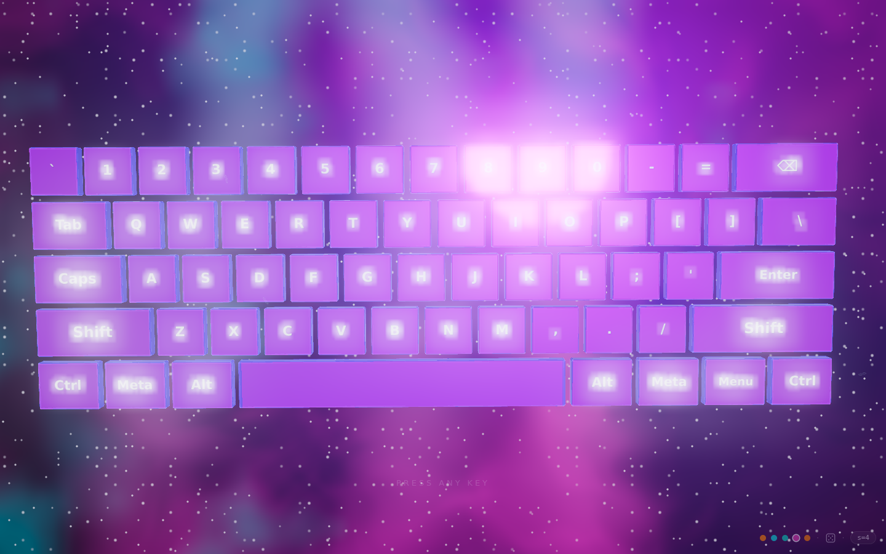

# keyboard visualizer

**A seed-driven generative instrument — every keystroke is light and sound.**

A desktop-only web page: a stylized QWERTY keyboard sits centered in a Three.js
scene, viewed near-top-down like a control panel. Every keypress fires a
cinematic visual effect and a synthesized note. One seed produces the entire
style — colors, background shader, particles, keyboard material, animation, and
sound. Five named themes are pinned points in that style space; the randomizer
samples new ones.



> Live: _add your Vercel URL here_ · try `?s=2` (Ice), `?s=4` (Space), or roll the dice.

## How it works

```
seed (uint32, in URL)
   │  sfc32 PRNG
   ▼
StyleParams { primary/secondary anchor, blend t, per-dial jitter }
   │  composeStyle()  ← the ONLY function that builds a Style
   ▼
Style { ~45 numeric dials, 6-stop OKLCH palette, one musical scale }
   │
   ├─► background shader uniforms   ├─► particle params
   ├─► keyboard materials/geometry  ├─► audio voice params
   └─► camera drift · bloom · UI accents
```

**One style space.** Everything downstream is a pure function of the current
`Style`, re-read every frame. There is no separate "preset" code path.

**Anchors are pinned seeds.** The five themes are reserved seeds `1..5`; they run
through the exact same `composeStyle()` as a random roll (with blend `t = 0` and
zero jitter). The randomizer just picks a new point — biased toward the nearest
anchors so every roll stays coherent.

**Sound and visuals from the same seed.** The palette, the horizon shader, the
particle physics, and the synth voice all read the same dials, so a style is a
single coherent mood across sight and sound. Copy the `?s=` URL and you reproduce
it exactly.

## The dials

Every visual and sonic property is a single number with a hard range and a
randomizer jitter amount. The table of all 49 dials — background, particles,
keyboard, animation, camera, post, and audio — is the source of truth in
[`src/style/dials.ts`](src/style/dials.ts). The five anchor palettes and scales
live in [`src/style/anchors.ts`](src/style/anchors.ts).

## Controls

| Action | Input |
|---|---|
| Play | type on your keyboard |
| Themes | `F1`–`F5` (Mountains, Ice, Ocean, Space, Desert) or click the dots |
| Randomize | `F6` or click the dice |
| Copy link | `F7` or click the `s=…` seed chip |
| Load a seed | visit `?s=<base36>` |

Everything except the F-keys belongs to the instrument, so the chrome lives only
on keys that don't type. The HUD fades away after a few seconds of mouse idle.

## Running locally

```bash
npm install
npm run dev      # http://localhost:5173
npm run build    # typecheck + production build to dist/
npm test         # determinism + color unit tests
```

## Tech notes

- **Vite + TypeScript (strict) + Three.js** (`^0.165`), no other runtime deps.
- **Custom GLSL**: one background shader composites all five looks via uniform
  weights; particles are GPU-simulated (all motion in the vertex shader).
- **Hand-written OKLCH pipeline** — all palette blending is perceptual
  (shortest-arc hue), converted to linear sRGB only at the boundary. No color lib.
- **Web Audio synthesis** — every note is generated (oscillator morph + FM +
  filtered noise + envelope + reverb/delay). No samples, no fonts fetched.
- **Seeded `sfc32`** everywhere; `Math.random()` is banned by lint.
- **Reduced-motion** support and an FPS quality governor keep it smooth and calm.

## License

MIT — see [LICENSE](LICENSE).
